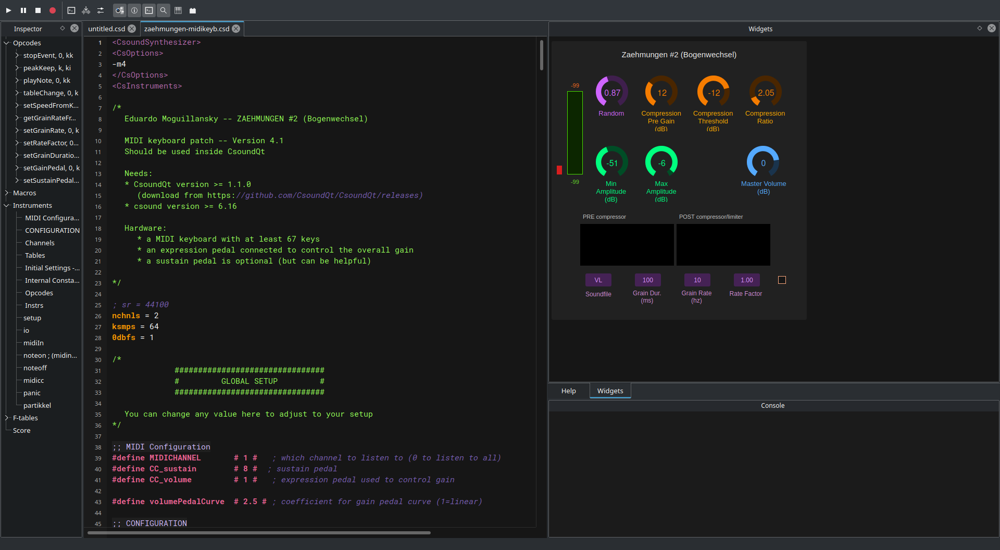

# Eduardo Moguillansky -- ZAEHMUNGEN #2 (Bogenwechsel)

MIDI keyboard patch -- Version 4.1
Should be used inside CsoundQt

**Needs**: 

* CsoundQt version >= 1.1.0 (download from https://github.com/CsoundQt/CsoundQt/releases)
* csound version >= 6.16
       
**Hardware**:

* a MIDI keyboard with at least 67 keys
* an expression pedal connected to control the overall gain
* a sustain pedal is optional (but can be helpful)

